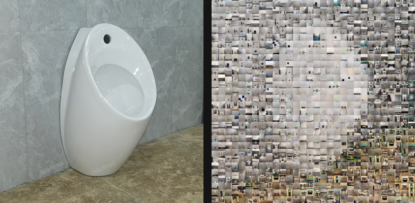

# mosaic-builder

Build photo mosaics from your own gallery, backed by DuckDB.

A gallery of photos is sliced into texture-scored square "character tiles". Each tile is normalized
to a uniform square and stored in DuckDB with its average color in both RGB and CIE-LAB. A target
image is then divided into a grid, each cell is matched to the closest tile by perceptual color
distance, and the chosen tiles are assembled into the finished mosaic.

## Install

```bash
uv sync
uv run pytest -q
```

## Quickstart

Three commands take you from a folder of photos to a mosaic.

```bash
# 1. Ingest a gallery into the database
uv run mosaic-builder ingest gallery --db mosaic.duckdb --tile-side 64

# 2. Check whether the gallery is varied enough to make a good mosaic
uv run mosaic-builder validate --db mosaic.duckdb

# 3. Match a target and render the mosaic in one step
uv run mosaic-builder mosaic path/to/target.png --db mosaic.duckdb \
    --grain 32 --diversity 3 --out mosaic.png

open mosaic.png
```

Every subcommand also runs as a module, for example `python -m mosaic_builder.ingest`.

## Example



This mosaic was built from the full gallery (480 photos, 1440 tiles
at `--tile-side 64`) against a target the user chose:

```bash
mosaic-builder mosaic examples/target_images/target_urinal_01.png --db mosaic.duckdb --grain 25 --tile-side 64 --diversity 3.0 --out examples/output/urinal_mosaic.png
```

| Grid | Distinct tiles used | Mean color error (ΔE) | Gallery size |
|---|---|---|---|
| 30×30 cells | 281 | 4.643 | 480 images, 1440 tiles |

These outputs were generated by Section 10 of `notebooks/visual_demo.ipynb` and are committed to
`examples/output/`. Regenerating them requires the full gallery and its ingested database, so unlike
the rest of the notebook this section is not runnable from a fresh clone alone; the committed files
are the proof.

## grain versus tile-side

These two numbers are easy to confuse and control different things.

**`--tile-side`** is how many pixels wide each stored tile is. It is fixed when you ingest, and it
sets the resolution of the mosaic's building blocks. **`--grain`** is how many pixels of the
*target* image one grid cell covers. It is chosen at match time and it decides how many cells the
mosaic has: a 1024-pixel-wide target at `--grain 32` gives 32 columns.

The output size is the grid size times the tile side. A 32 by 32 grid of 64-pixel tiles produces a
2048 by 2048 image. Smaller grain means more cells, a closer likeness, and a bigger output.

## Commands

### ingest

| Flag | Default | Meaning |
|---|---|---|
| `images_dir` | required | Directory of source photos |
| `--db` | `mosaic.duckdb` | Database to write |
| `--tile-side` | `64` | Pixel edge length every tile is resized to |
| `--max-tiles` | `3` | Maximum tiles extracted per photo |
| `--no-progress` | off | Suppress the progress bar |

### validate

| Flag | Default | Meaning |
|---|---|---|
| `--db` | `mosaic.duckdb` | Database to read |
| `--tile-side` | all | Restrict the report to one tile side |
| `--json` | off | Emit JSON instead of a table |

Reports tile counts, color ranges, the coverage histogram, the lowest-texture tiles, the most
fixture-like tiles, and the mean nearest-neighbor color distance. A low nearest-neighbor value means
many near-duplicate tiles. See [What the tile scores mean](#what-the-tile-scores-mean) for how to
read each number.

### mosaic

| Flag | Default | Meaning |
|---|---|---|
| `target` | required | Image to reproduce |
| `--db` | `mosaic.duckdb` | Database to read |
| `--grain` | required | Target pixels per grid cell |
| `--tile-side` | auto | Which stored tile side to use |
| `--diversity` | `3.0` | 0-10: favour tile variety over exact color match, 0 for pure match |
| `--blend` | `0.0` | Blend the result toward the target, 0 to 1 |
| `--out` | required | Output PNG |
| `--keep-match` | off | Also write the assignments as JSON |
| `--no-progress` | off | Suppress the progress bar |

### match and render

`mosaic` is `match` followed by `render`. Run them separately when you want to inspect or hand-edit
the assignments, or re-render at a different `--blend` without matching again.

```bash
uv run mosaic-builder match target.png --db mosaic.duckdb --grain 32 --out match.json
uv run mosaic-builder render match.json --db mosaic.duckdb --out mosaic.png
```

### preview

```bash
uv run mosaic-builder preview --db mosaic.duckdb --out preview.html --first-n 25
```

Renders an HTML page of stored tiles so you can audit extraction quality. Use `--first-n` or
`--random-n` to sample; the full gallery produces a very large file.

## What the tile scores mean

Every tile gets measured a few different ways. The numbers show up in `validate` reports and under
each thumbnail in `preview`. In plain terms:

| Score | What it measures | High means | Low means |
|---|---|---|---|
| **texture** (`score`) | How much is *going on* in the tile — variation in brightness from pixel to pixel. | Busy, detailed, lots of edges. | Flat and uniform, like a blank patch of wall or sky. |
| **coverage** | How much of the original photo this crop came from. | The crop is most of the photo. | The crop is a small corner of a much bigger photo. |
| **color contrast** | Whether the tile splits into two clearly different brightness regions — a dark thing against a light background, or vice versa. | Something distinct stands out against its background. | All one tone (a white wall), or only thin dark lines on a light field (grout). |
| **periodicity** | Whether the tile has a regular repeating pattern. Runs from 0 to 1. | A grid — tiled walls, brickwork, grout lines. | No repeating pattern — a smooth, curved, or irregular surface. |
| **fixture** | A combined guess at whether the tile shows *an object* rather than *the background behind it*. Runs from 0 to 1. | Probably an object (a toilet, urinal, sink). | Probably background. |

The **fixture** score is the only one that isn't measured directly — it's a judgment call that
weighs up two separate clues, with color counting for more because it's the less ambiguous of the
two:

- **Color separation.** A black urinal against a white wall is obvious from color alone, whatever
  the wall is made of.
- **Lack of a repeating pattern.** When color can't help (a *white* urinal against a *white* wall
  looks the same either way), a regular grid is probably the wall and a smooth, non-repeating
  surface is probably the fixture.

Whatever those two clues add up to then gets scaled by how much is in the tile at all, so a blank
patch scores near zero instead of being mistaken for a smooth fixture.

**The pattern clue assumes the background is patterned** — tiled, grouted, brickwork. A repeating
grid is the only thing it recognizes as "background." Against a plain painted wall, a smooth
partition, or open space, it has nothing to go on. So the score is much more trustworthy on the
dark-object-against-light-wall case than on the everything-is-the-same-white case.

Because color carries most of the weight, a white-fixture-on-white-wall tile can only ever reach
about 0.3 — the score reflects *confidence*, not just likelihood, so weak-evidence fixtures
deliberately rank below strong-evidence ones. Roughly what to expect:

| Score | Typical tile |
|---|---|
| ~0.00 | Blank, featureless patch |
| ~0.07 | Tiled or grouted wall |
| ~0.29 | Smooth white fixture against a white wall |
| ~0.56 | A clearly separated object |
| ~0.84 | Dark fixture against a light wall |

The thresholds behind it are still first-guess values rather than tuned against a real gallery, so
treat it as a sorting hint rather than a verdict. Because it's calculated fresh each time you run
`validate` or `preview` rather than being stored, retuning takes effect immediately with no need to
re-ingest.

## Tuning quality versus variety

At `--diversity 0` the matcher picks the single closest tile for every cell, so a handful of tiles
repeat across large flat areas. Turning the dial up makes each tile cost a little more every time
it's reused — more still if it was used near the current cell — so the matcher spreads work across
comparable alternatives.

It's a preference, not a rule. A reused tile can still win if it's a markedly better color match,
so the dial won't drop an obviously wrong tile into your mosaic just to add variety.

Measured on a 480-photo gallery (1440 tiles) against the urinal target at grain 25 — a 30 by 30
grid, 900 cells:

| `--diversity` | Mean color error | Worst cell | Distinct tiles | Most-reused tile |
|---|---|---|---|---|
| 0 | 3.24 | 5.21 | 76 | **138 cells** |
| 1 | 4.82 | 9.43 | 467 | 6 |
| 2 | 5.40 | 11.03 | 604 | 4 |
| 3 *(default)* | 5.77 | 12.18 | 699 | 3 |
| 5 | 6.40 | 12.97 | 815 | 2 |
| 7 | 6.70 | 13.77 | 856 | 2 |
| 10 | 7.04 | 16.27 | 889 | 2 |

The first step off 0 is where almost all the benefit is: it costs 1.6 color error and buys 391 more
distinct tiles, dropping the most-reused tile from 138 placements to 6. Color errors past roughly 12
start to read as visibly wrong, so this gallery has room up to about 3 before the worst cells start
crossing that line. Run `validate` on your own gallery to see where its limit sits.

The penalty is measured against each tile's fair share (`cells / tiles`), so a dial position means
the same thing whether the gallery holds 50 tiles or 5000. Without that scaling, a gallery with
fewer tiles than cells would be charged for repeats it has no way to avoid, and colour accuracy
would collapse.

## Databases and schema

One database file holds tiles at a single `--tile-side`. To try a different size, write to a new
file or delete the existing one and re-ingest.

The schema is versioned. Opening a database written by an older version fails immediately with a
message telling you to delete it and re-ingest. There are no migrations, because re-ingesting a
480-photo gallery takes under two minutes.

## Repository layout

- `CONTEXT.md` records the design intent, validated assumptions, and measured gallery statistics.
- `PLAN.md` is the task-by-task execution plan, including work not yet done.
- `notebooks/visual_demo.ipynb` walks through every stage visually and runs without a personal
  gallery, generating synthetic images when none is present.
